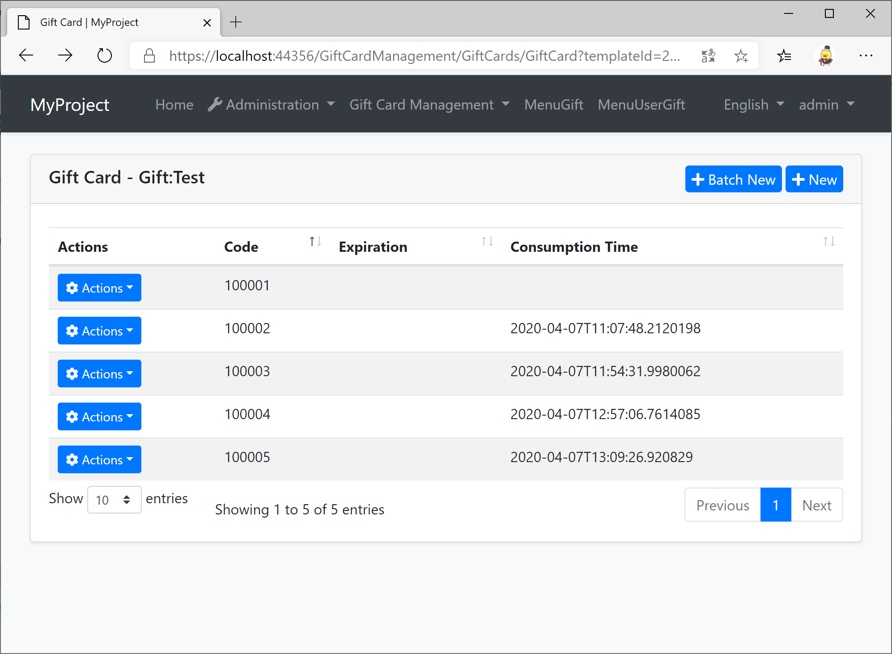
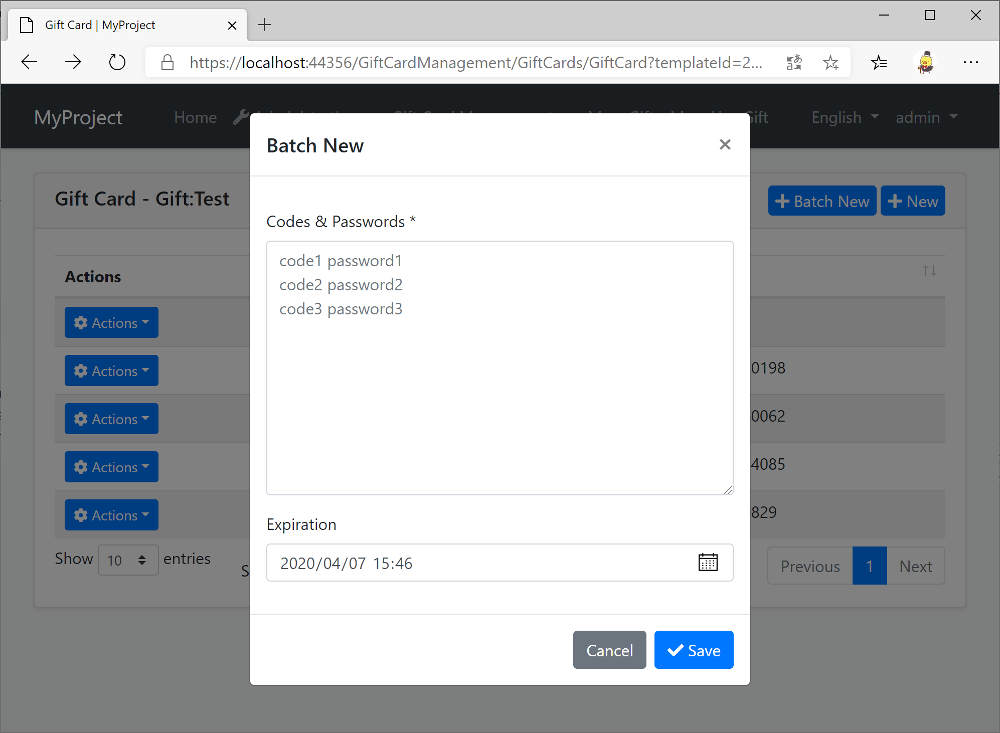

# GiftCardManagement
An abp application module where you can create gift cards and your app user can use them to exchange something.

## Getting Started

* Install with [AbpHelper](https://github.com/EasyAbp/AbpHelper.GUI)

    Coming soon.

* Install Manually

    1. Install `EasyAbp.GiftCardManagement.Application` NuGet package to `MyProject.Application` project and add `[DependsOn(GiftCardManagementApplicationModule)]` attribute to the module.

    1. Install `EasyAbp.GiftCardManagement.Application.Contracts` NuGet package to `MyProject.Application.Contracts` project and add `[DependsOn(GiftCardManagementApplicationContractsModule)]` attribute to the module.

    1. Install `EasyAbp.GiftCardManagement.Domain` NuGet package to `MyProject.Domain` project and add `[DependsOn(GiftCardManagementDomainModule)]` attribute to the module.

    1. Install `EasyAbp.GiftCardManagement.Domain.Shared` NuGet package to `MyProject.Domain.Shared` project and add `[DependsOn(GiftCardManagementDomainSharedModule)]` attribute to the module.

    1. Install `EasyAbp.GiftCardManagement.EntityFrameworkCore` NuGet package to `MyProject.EntityFrameworkCore` project and add `[DependsOn(GiftCardManagementEntityFrameworkCoreModule)]` attribute to the module.

    1. Install `EasyAbp.GiftCardManagement.HttpApi` NuGet package to `MyProject.HttpApi` project and add `[DependsOn(GiftCardManagementHttpApiModule)]` attribute to the module.

    1. Install `EasyAbp.GiftCardManagement.HttpApi.Client` NuGet package to `MyProject.HttpApi.Client` project and add `[DependsOn(GiftCardManagementHttpApiClientModule)]` attribute to the module.

    1. Install `EasyAbp.GiftCardManagement.MongoDB` NuGet package to `MyProject.MongoDB` project and add `[DependsOn(GiftCardManagementMongoDbModule)]` attribute to the module.

    1. (Optional) If you need MVC UI, install `EasyAbp.GiftCardManagement.Web` NuGet package to `MyProject.Web` project and add `[DependsOn(GiftCardManagementWebModule)]` attribute to the module.
    
    1. Add `options.ConventionalControllers.Create(typeof(GiftCardManagementApplicationModule).Assembly);` to `Configure<AbpAspNetCoreMvcOptions>(options => { ... });` in your host module (It is usually Web project or HttpApi.Host project).
    
    1. Add `builder.ConfigureGiftCardManagement();` to OnModelCreating method in `MyProjectMigrationsDbContext.cs`.

    1. Add EF Core migrations and update your database. See: [ABP document](https://docs.abp.io/en/abp/latest/Tutorials/Part-1?UI=MVC#add-new-migration-update-the-database).

## Usage

1. Add permissions to the roles you want.

1. Create a gift card template.

1. Create a gift card.

1. Handle the gift card consumption distributed event. See [Handle ](doc/Handle-Consumption-Event.md).

1. Try to consume the gift card.

## Roadmap

- [ ] Improve management pages.
- [ ] Unit tests.
